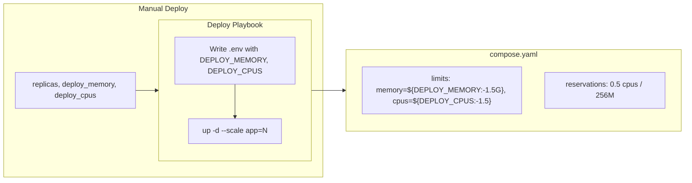

# Template Replicas, CPUs, Memory, and Reservations

## Current State

- **Compose**: All 4 templates (go, node, nextjs, python) use `deploy.resources.limits` with `memory: {{ cookiecutter.memory_limit }}` and `cpus: "1.0"`; no reservations.
- **Manual Deploy**: Accepts `image_tag` and `target_env`; passes them to Ansible; deploy playbook writes `.env` with `TRAEFIK_HOST` and `IMAGE_TAG`.
- **CI/CD**: Uses defaults; does not pass replicas/cpus/memory.
- **Docker Compose**: Runs in standalone mode (non-swarm). `deploy.replicas` is ignored; scaling uses `docker compose up -d --scale app=N`.

## Design

### 1. Unified resource defaults (all templates)


|                   | reservations    | limits (default) |
| ----------------- | --------------- | ---------------- |
| **All templates** | 0.5 cpus / 256M | 1.5 cpus / 1.5G  |


- Add `cpus_default: "1.5"` and `memory_limit: "1.5G"` to each template's cookiecutter.json.
- Add `replicas_default: 1` (or keep implicit; Manual Deploy override only).
- Reservations: fixed `0.5` cpus / `256M` memory in compose for all templates.

### 2. Compose variable substitution

Compose supports `${VAR:-default}`. After cookiecutter, the generated compose will use:

```yaml
deploy:
  resources:
    limits:
      memory: ${DEPLOY_MEMORY:-1.5G}
      cpus: "${DEPLOY_CPUS:-1.5}"
    reservations:
      memory: 256M
      cpus: "0.5"
```

- Use literal defaults in compose (from cookiecutter at template time): `memory: ${DEPLOY_MEMORY:-{{ cookiecutter.memory_limit }}}`, `cpus: "${DEPLOY_CPUS:-{{ cookiecutter.cpus_default }}}"`.
- Reservations are fixed per template: `0.5` cpus / `256M` memory.

### 3. Manual Deploy optional inputs

Add optional `workflow_dispatch` inputs:

```yaml
replicas:
  description: 'Number of replicas (default: 1)'
  required: false
  type: number
  default: 1
deploy_memory:
  description: 'Memory limit (e.g. 512M, 1.5G)'
  required: false
  type: string
deploy_cpus:
  description: 'CPU limit (e.g. 1.0, 1.5)'
  required: false
  type: string
```

Pass to Ansible when provided: `-e replicas=2 -e deploy_memory=1G -e deploy_cpus=2.0`.

### 4. Deploy playbook changes

- **Write .env**: Add `DEPLOY_MEMORY`, `DEPLOY_CPUS` when provided (e.g. via `deploy_memory`, `deploy_cpus` vars).
- **Pull and start**: Use `docker compose up -d --scale app={{ replicas | default(1) }}` so replicas are applied in standalone mode.

### 5. CI/CD

No changes. CI/CD does not pass `replicas`, `deploy_memory`, `deploy_cpus`; compose and deploy use template defaults.

## Files to Modify


| File                                                                            | Changes                                                                                           |
| ------------------------------------------------------------------------------- | ------------------------------------------------------------------------------------------------- |
| `templates/*/cookiecutter.json`                                                 | Add `cpus_default: "1.5"`; set `memory_limit: "1.5G"`                                             |
| `templates/*/{{cookiecutter.project_slug}}/compose.yaml`                        | Use `${DEPLOY_MEMORY:-...}`, `${DEPLOY_CPUS:-...}`; add `reservations: cpus: "0.5", memory: 256M` |
| `templates/*/{{cookiecutter.project_slug}}/.github/workflows/manual-deploy.yml` | Add optional inputs; pass to ansible                                                              |
| `templates/*/{{cookiecutter.project_slug}}/.github/deploy.yml`                  | Write DEPLOY_MEMORY/CPUS to .env when set; use `--scale app={{ replicas                           |


## Reservations and limits (unified)

- **reservations**: `memory: 256M`, `cpus: "0.5"` (all templates)
- **limits (default)**: `memory: 1.5G`, `cpus: "1.5"` (all templates; overridable via Manual Deploy)

## Flow Diagram


